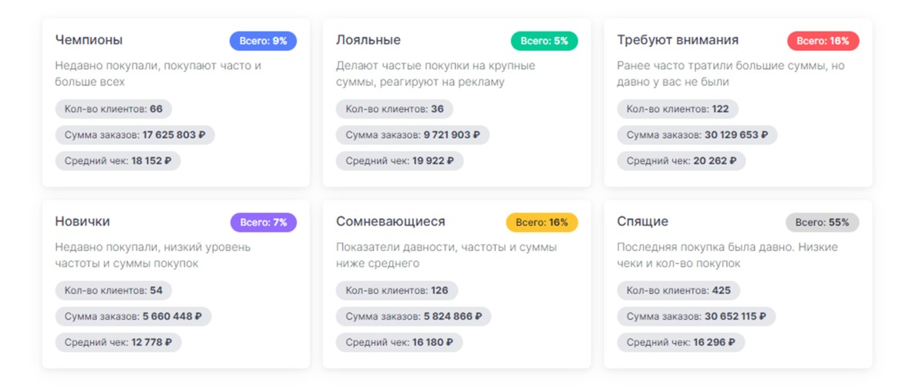

## Тестовое задание на вакансию Fullstack-разработчика

В новом чистом проекте Laravel создать страницу, где будет выводиться список RFM-сегментов:

Список сегментов должен выглядеть примерно как на скрине. Использовать Tailwind Css.

Данные по сегментам можно получить по API:

1) Получить токен авторизации с помощью логина и пароля:

*curl --location 'https://vivarolls.magic-of-numbers.ru:8686/user/token' \\*

*--form 'username="test@com.ru"' \\*

*--form 'password="!Sdc987gS5d@3"'

2) Сделать запрос на /reports и найти отчёт с названием "get\_segment\_rfm"

curl --location 'https://vivarolls.magic-of-numbers.ru:8686/reports' \\

--header 'Authorization: Bearer test'

3) Сделать запрос на /report/{id}/run, получить и вывести список сегментов

curl -X 'POST' \\

'https://vivarolls.magic-of-numbers.ru:8686/report/id/run' \\

-H 'accept: application/json' \\

-H 'Authorization: Bearer test' \\

-H 'Content-Type: application/json' \\

-d '{}'

Кол-во клиентов - doc\_count

Кол-во заказов - orders.value

Сумма заказов - total.value

Средний чек - посчитать самостоятельно

Всего % - процент от общего кол-ва, посчитать по формуле: (Всего клиентов (total) / Кол-во клиентов в сегменте (doc\_count)) \* 100

**Результат работы**

Проект опубликовать на гит и прислать ссылку.
